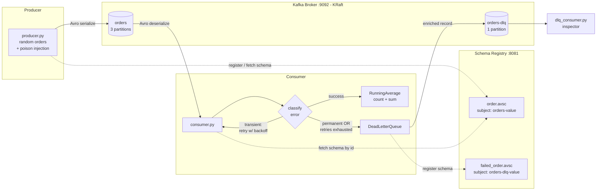

# Kafka Order Processing Pipeline

A Kafka-based system that produces and consumes purchase-order events using
**Avro serialization**, maintains a **real-time running average price**, and
handles failures through **retry logic with exponential backoff** and a
**Dead Letter Queue (DLQ)** for messages that cannot be processed.

Built for Chapter 3 (Data Ingestion & Orchestration) of the Big Data module.

---

## 1. Architecture



### Components

| Component | File | Responsibility |
|---|---|---|
| Infrastructure | `docker-compose.yml` | Kafka (KRaft mode), Schema Registry, Kafka UI |
| Schema | `schemas/order.avsc` | Contract for order events |
| Schema | `schemas/failed_order.avsc` | Enriched contract for DLQ records |
| Producer | `src/producer.py` | Generates randomised (and optionally poison) order events, Avro-serialized |
| Consumer | `src/consumer.py` | Deserializes orders, maintains running average, routes failures |
| Retry logic | `src/retry.py` | Exponential backoff with full jitter |
| Error taxonomy | `src/errors.py` | `TransientError` vs `PermanentError` |
| Business rules | `src/processing.py` | Order validation + simulated transient-fault injection |
| DLQ producer | `src/dlq.py` | Publishes enriched failure records to `orders-dlq` |
| DLQ inspector | `src/dlq_consumer.py` | Standalone consumer that prints DLQ contents |
| Topic setup | `src/create_topics.py` | Creates `orders` (3 partitions) and `orders-dlq` (1 partition) |
| Schema registration | `src/register_schema.py` | Manually registers `order.avsc` |
| Config | `src/config.py` | Central, environment-overridable settings |

---

## 2. Prerequisites

- **Docker Desktop**, running, with at least 4 GB memory allocated (Settings → Resources)
- **Python 3.13**
- `confluent-kafka==2.6.1` — note this specific version. `2.5.0` and earlier have
  no pre-built wheel for Python 3.13, so `pip install` silently falls back to
  building from source and fails on Windows without a C toolchain.

---

## 3. Quick Start

```powershell
# 1. Bring up Kafka, Schema Registry, Kafka UI
docker compose up -d
docker compose ps                       # all three should be Up
curl.exe http://localhost:8081/subjects # expect []

# 2. Python environment
python -m venv venv
.\venv\Scripts\Activate.ps1
pip install -r requirements.txt

# 3. Create topics and register the schema
cd src
python create_topics.py
python register_schema.py
cd ..
```

Then, in three separate terminals (venv activated in each, running from `src/`):

```powershell
# Terminal 1 — consumer with running average, retry, and DLQ routing
cd src
python consumer.py

# Terminal 2 — DLQ inspector
cd src
python dlq_consumer.py

# Terminal 3 — producer
cd src
python producer.py --count 20 --poison 4 --delay 0.4
```

Kafka UI is available at **http://localhost:8090** to inspect topics, partitions,
and messages visually.

---

## 4. Configuration

All settings are environment-overridable via `src/config.py`.

| Variable | Default | Purpose |
|---|---|---|
| `BOOTSTRAP_SERVERS` | `localhost:9092` | Kafka broker address |
| `SCHEMA_REGISTRY_URL` | `http://localhost:8081` | Schema Registry address |
| `CONSUMER_GROUP` | `order-aggregator` | Consumer group id (change for a fresh replay without resetting offsets) |
| `TRANSIENT_FAILURE_RATE` | `0.3` | Probability the consumer simulates a transient downstream failure |
| `MAX_RETRIES` | `3` | Retry attempts before a transient failure is routed to the DLQ |

Example — force more visible failures during a demo:

```powershell
$env:TRANSIENT_FAILURE_RATE = "0.7"
python consumer.py
```

---

## 5. Order Schema (`order.avsc`)

| Field | Type | Description |
|---|---|---|
| `orderId` | `string` | Unique identifier, e.g. `"1001"` |
| `product` | `string` | Product name, e.g. `"Item1"` |
| `price` | `float` | Randomised purchase price |

## 6. DLQ Schema (`failed_order.avsc`)

Carries the original order **plus** failure context, so a failed message can
be triaged and its source located for replay:

| Field | Type | Description |
|---|---|---|
| `orderId`, `product`, `price` | as above | Original order data |
| `errorType` | `string` | `TransientError` or `PermanentError` |
| `errorMessage` | `string` | Exception detail |
| `retryCount` | `int` | Attempts made before giving up |
| `failedAt` | `long` (logical type `timestamp-millis`) | When it was routed to the DLQ |
| `sourceTopic` / `sourcePartition` / `sourceOffset` | `string` / `int` / `long` | Exact coordinates of the original message |

---

## 7. Design Decisions

**Avro over JSON.** Schema Registry enforces a contract between producer and
consumer at write time, catching mismatches before bad data ever lands. Avro
payloads carry no field names on the wire — only a 5-byte header (magic byte
+ schema ID) followed by binary-packed values — making them significantly
smaller than the equivalent JSON.

**`acks=all` + `enable.idempotence=True`.** The producer waits for every
in-sync replica to persist a record before acknowledging it (durability), and
the broker deduplicates retried sends via producer ID + sequence number
(no duplicate writes from retries).

**`orderId` as the partition key.** All events for a given order land on the
same partition, preserving per-order ordering, while different orders spread
across partitions for parallelism. The trade-off: no *global* ordering
guarantee across all orders, only per-key ordering.

**Manual offset commits, after processing.** `enable.auto.commit=False`
combined with committing only once an order has succeeded or been routed to
the DLQ gives **at-least-once** delivery: a crash before commit causes
redelivery (a small chance of duplicate processing) rather than silent data
loss.

**Transient vs. permanent error taxonomy.** Transient failures (simulated
downstream unavailability) are retried with exponential backoff, since
retrying is likely to succeed. Permanent failures (negative price, unknown
product, malformed ID) fail immediately with **zero retries**, because
retrying a poison message wastes time and — critically — blocks every message
behind it in the partition.

**Exponential backoff with full jitter.** Delay doubles each attempt
(0.5s → 1s → 2s → …, capped at 8s) and is drawn uniformly from
`[0, capped_delay]`. Doubling gives an overloaded downstream room to recover;
jitter prevents every failed consumer from retrying in lockstep and causing a
synchronized traffic spike.

**Enriched DLQ schema.** A DLQ that mirrors the original message tells you
*that* something failed but not *why*. Carrying error type, message, retry
count, and source coordinates makes every failure triageable and replayable
without extra lookups.

**Blocking `flush()` on every DLQ write.** The DLQ write is confirmed by the
broker *before* the source offset is committed. This guarantees a message is
never lost between the two topics, at the cost of throughput on the failure
path (an acceptable trade-off, since failures are the minority case).

---

## 8. Known Limitations

- **At-least-once delivery, not exactly-once.** A crash between successful
  processing and offset commit causes redelivery and a duplicate count in the
  running average. True exactly-once would require Kafka transactions or an
  idempotent sink keyed on `orderId`.
- **Avro `float` is 32-bit.** Python's native float is a 64-bit double, so
  precision is lost on the wire (e.g. `199.99` becomes `199.99000549316406`
  after a round trip). Acceptable for a demo; real monetary values should use
  `bytes` with a `decimal` logical type or integer cents.
- **`time.sleep()` blocks the poll loop during retries.** With the current
  settings (3 retries, 8s cap) this is far below Kafka's
  `max.poll.interval.ms` default of 5 minutes, but a longer retry chain could
  trigger an unwanted consumer group rebalance. A production system would use
  tiered retry topics (`orders-retry-5s`, `orders-retry-30s`, …) instead of
  blocking.
- **Running average is per-consumer-instance, not global.** Each consumer in
  a group maintains its own count/sum over only the partitions it owns. A
  true cluster-wide average would need Kafka Streams with a shared state
  store, or an external aggregator (e.g. Redis).
- **Single broker, replication factor 1.** No real fault tolerance; a
  production deployment would use at least 3 brokers with
  `min.insync.replicas=2`.

---

## 9. Sample Output (verified run)

**Consumer — retries, recovery, and all four permanent-failure types:**

```
p0@65   key=1000   Item5  price=  249.16
      OK | count=1    avg=249.1600
p2@9    key=1001   Item1  price=  467.08
      transient (attempt 1/3): downstream service unavailable (simulated) — retrying in 0.17s
      recovered on attempt 2
      OK | count=2    avg=358.1200
p1@5    key=1004   Item1  price=  154.52
      OK | count=5    avg=253.5040
p2@11   key=9000   Item1  price=  -50.00
      PERMANENT: non-positive price: -50.0 — no retry
      -> DLQ partition 0 offset 6
p0@67   key=9002   Item2  price=999999.00
      PERMANENT: price exceeds sanity limit: 999999.0 — no retry
      -> DLQ partition 0 offset 7
p1@6    key=9001   HackedItem price=   99.00
      PERMANENT: unknown product: 'HackedItem' — no retry
      -> DLQ partition 0 offset 8
p1@7    key=BAD-3  Item3  price=   25.00
      PERMANENT: malformed orderId: 'BAD-3' — no retry
      -> DLQ partition 0 offset 9
```

**DLQ inspector — every failure with full triage context:**

```
--- DLQ #7 (offset 6) ---
  order     : 9000  Item1  -50.00
  error     : PermanentError: non-positive price: -50.0
  attempts  : 1
  failed at : 17:13:51
  origin    : orders[2]@11

--- DLQ #8 (offset 7) ---
  order     : 9002  Item2  999999.00
  error     : PermanentError: price exceeds sanity limit: 999999.0
  attempts  : 1
  failed at : 17:13:54
  origin    : orders[0]@67
```

Note messages spread across partitions `p0`, `p1`, `p2` — confirming keyed
partitioning is active — and permanent errors fail on attempt 1 with no
retry, while transient errors retry and mostly recover.

---

## 10. Useful Operational Commands

```powershell
# Describe a topic (partitions, replicas, ISR)
docker exec kafka kafka-topics --bootstrap-server localhost:9092 --describe --topic orders

# Check consumer group lag
docker exec kafka kafka-consumer-groups --bootstrap-server localhost:9092 --describe --group order-aggregator

# Replay the entire orders topic from the beginning
docker exec kafka kafka-consumer-groups --bootstrap-server localhost:9092 --group order-aggregator --topic orders --reset-offsets --to-earliest --execute

# List registered schema subjects
curl.exe http://localhost:8081/subjects
```

---

## 11. Tech Stack

- **Apache Kafka** (Confluent image, KRaft mode — no ZooKeeper)
- **Confluent Schema Registry**
- **Avro** serialization (`confluent-kafka[avro,schemaregistry]==2.6.1`)
- **Python 3.13**
- **Docker Compose** for local infrastructure
- **Kafka UI** for visual topic/message inspection